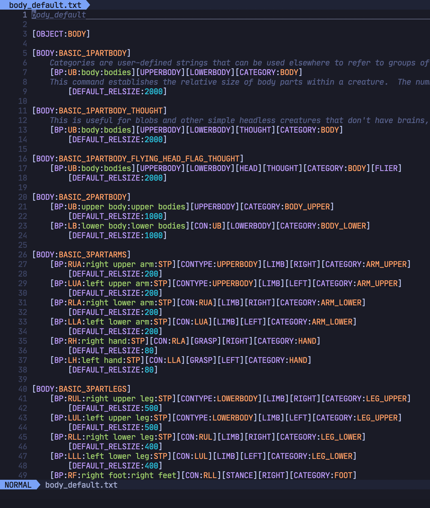
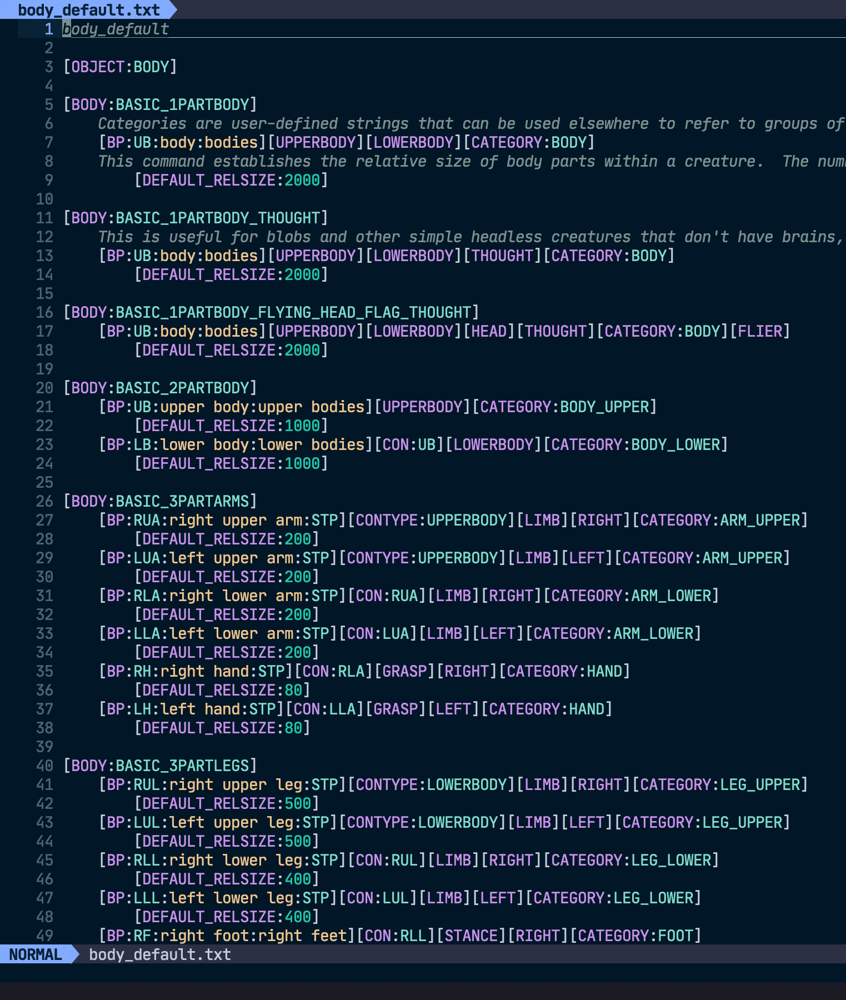

# tree-sitter-dfraw

A simple language parser and highlighter made with [tree-sitter](https://github.com/tree-sitter/tree-sitter)

[tokyonight](https://github.com/folke/tokyonight.nvim)



[nightfly](https://github.com/bluz71/vim-nightfly-guicolors)



# Using with [nvim-treesitter](https://github.com/nvim-treesitter/nvim-treesitter)

Please refer to the [adding parsers](https://github.com/nvim-treesitter/nvim-treesitter#advanced-setup) section on the nvim-treesitter page.

In order for syntax highlighting to work you copy `queries/highlights.scm` file from this repo to your nvim-treesitter location `queries/dfraw/highlights.scm`.
More information can be found on the nvim-treesitter page.

Example config:
```lua
local parser_config = require'nvim-treesitter.parsers'.get_parser_configs()
parser_config.dfraw = {
	install_info = {
		url = 'https://github.com/JellyApple102/tree-sitter-dfraw',
		files = { 'src/parser.c' },
		branch = 'main'
	},
	filetype = 'text',
	used_by = { 'dfraw' }
}
```
Wrap in `lua << EOF` and `EOF` to use in `init.vim`.

By default it is setup to start for any file of type 'text' or 'dfraw'. If you would not like to use it for all text files you can add a custom filetype to neovim.
Example `.config/nvim/scripts.vim`:
```vim
if did_filetype()
	finish
endif
if getline(1) =~# '[a-z_]'
	setfiletype dfraw
endif
```
This will match any file whose first line is just lowercase letters_and_underscores, and set the filetype to 'dfraw'.
Than change the config option `filetype = 'dfraw'` and remove the `used_by` option to only use 'dfraw' type files.

More information on custom filetypes [here](https://neovim.io/doc/user/filetype.html#new-filetype).

# Highlight Colors

Feel free to change the highlight groups set by `highlights.scm`. I have found that some colors schemes use the same or similar colors for different groups.
I have set them to what I like best using the [tokyonight](https://github.com/folke/tokyonight.nvim) theme.
